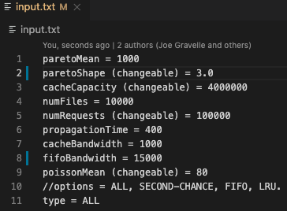

# CIS4930 Project
##### _Joseph Gravelle and Masen Beliveau_
***
###### Summary:
We have created a Network Cache Event-Driven Simulator for our final project. We coded our implementation in C++ and used LRU, FIFO, and Second Chance for our cache replacement policies. You can refer to the project report for more information about the project.
***
###### How to run:
In the same directory as the source code, there is a makefile used to compile the program. Run `make` in the terminal, then open the output.txt to take a look at what the simulation returns (we assume that you have c++ installed in orde to compile). It will show information on each of the cache replacement policies to give you a comparison of the three. If you would like to change the inputs, go to the inputs.txt file and alter whatever values you would like. We recommend you only change the following:
* Pareto Shape
* Cache Capacity
* Number of Requests (numRequests)
* Poisson Mean
* Type
For example, you can switch __pareto shape__ from 2.0 to 3.0:

 

The other values can be changed, but they are based on constants recommended in the Project document, so it is advised not to change this, as this may have nonconclusive results and dramatically increase the runtime.
